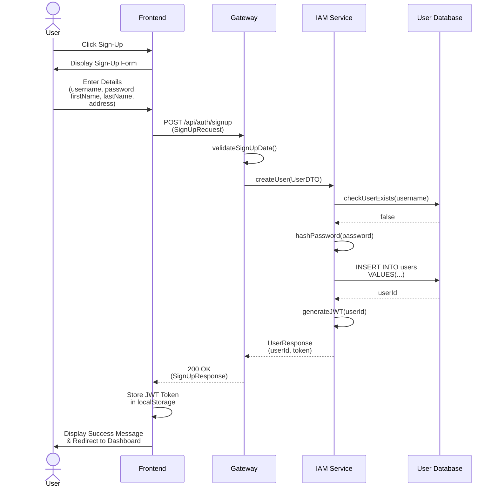

# Sequence Diagram: UC1.1 - User Sign-Up

## Description
This sequence diagram illustrates the user registration process where the user provides registration information including username, password, name, and shipping address. The Gateway service validates the input, forwards the request to the IAM Service, which checks for duplicate usernames, hashes the password, and stores the user information in the User database. Upon successful registration, a JWT token is generated and returned to the user.
